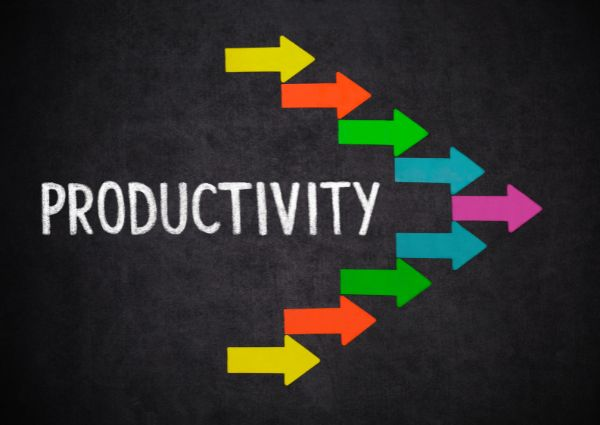

# 10 Best tools for productivity and efficiency

We like being productive, but sometimes it isn’t enough for us to do everything by ourselves, this is where it becomes necessary to look for extra help. In this article, we’ll outline what we believe are the 10 best tools for productivity and efficiency.

<!-- more -->

<figure markdown="span">
  
</figure>

## **1.Trello**

Trello is a versatile project management tool that uses boards, lists, and cards to help you organize and prioritize your tasks. Whether you're managing a team project, planning an event, or keeping track of personal goals, Trello's visual interface makes it easy to see what needs to be done and who's responsible for each task. With features like due dates, labels, and checklists, Trello keeps you organized and focused on what matters most.

If you are looking for solutions on [how to improve productivity](https://deepdeck.co/blog/how-to-improve-productivity/){:target="_blank"}, this is a good starting point.

## **2. Asana**

Asana is a project management and collaboration tool that helps teams plan, organize, and track their work. With features like task assignments, due dates, and progress tracking, Asana makes it easy to coordinate with team members and ensure that everyone stays on track. It integrates with apps such as Slack, Microsoft Teams, Google Workspace, and many others. 

In comparison with Trello, Asana offers robust customization options, including custom fields, templates, and advanced automation rules. This allows teams to tailor their workflows to specific needs and automate repetitive tasks, enhancing productivity.

On the other hand, Trello provides customization through its power-ups and Butler automation tool, which allows users to create custom buttons, rules, and scheduled commands. However, the level of customization and automation in Trello is generally less advanced compared to Asana.

## **3. Notion**

Notion is an all-in-one workspace that allows you to create, organize, and collaborate on documents, databases, and tasks. With its flexible structure and customizable layouts, Notion adapts to your workflow and allows you to organize information in whatever way works best for you.

Whether you're managing projects, taking notes, or tracking your goals, Notion helps you stay organized and productive. The best of all is, that it is fully customizable, and it can be shared with your team. This tool is great for [keeping focused at work](https://deepdeck.co/blog/how-to-keep-focused-at-work/){:target="_blank"} since you can find all you need in one place, and you won’t need to scroll through several Google Drive folders or files.

## **4. Zapier**

Zapier is an automation platform that connects your favorite apps and services to automate repetitive tasks and streamline your workflow (somehow similar to our [macropad](https://deepdeck.co/blog/macropad-definition/){:target="_blank"}).

!!! Tip 
    A macropad like DeepDeck can be programmed to execute any macro on your computer.

With Zapier, you can create automated workflows called "Zaps" that trigger actions in one app based on events in another. Whether you're automating data entry, syncing information between apps, or triggering notifications based on specific conditions, Zapier helps you save time and stay organized by eliminating manual tasks and reducing human error thanks to its thousands of pre-built integrations and customizable workflows. 

For example, you can automate the process of adding new leads from a web form to your CRM. When someone submits a form on your website, Zapier can automatically create a new contact in your CRM system and send a follow-up email to the lead. This automation saves time and ensures no lead is missed, helping you stay organized and responsive.

## **5. Todoist**

We have met several people who love to work with to-do lists. Todoist is a powerful task management tool that easily creates and organizes your to-do lists. 

With features like due dates, priority levels, and project categorization, Todoist helps you stay on top of your tasks and deadlines. Plus, its intuitive interface and seamless integration with other productivity apps make it a must-have for anyone looking to improve their productivity.

## **6. Evernote**

Evernote is a note-taking app that allows you to capture ideas, thoughts, and information in various formats, including text, images, audio, and web clippings. With its powerful search capabilities and cross-platform synchronization, Evernote makes it easy to access and organize your notes from anywhere. 

It doesn’t matter if you are brainstorming ideas, conducting research, or planning a new project, Evernote helps you stay organized and productive.

## **7. Google Workspace**

This suite of cloud-based productivity tools includes Gmail, Google Drive, Google Docs, Google Sheets, Meet, and more. With Google Workspace, you can collaborate with team members in real time, store and share files securely, and communicate effectively via email, chat, and video conferencing. 

It may be more traditional than Notion (our personal opinion), but it provides a full ecosystem of tools that can help you keep productive in your daily activities.

## **8. Discord**

Discord is a communication platform that centralizes all your group's interactions in one place. With features like servers, text channels, voice channels, and video calls, Discord makes it simple to collaborate with friends, share information, and stay connected no matter where you are. 

Text channels allow for organized discussions on specific topics, while voice channels enable seamless voice communication. Video calls in Discord bring a personal touch to your interactions, perfect for meetings, gaming sessions, or just catching up face-to-face. Whether you're coordinating a project, playing games together, or having a virtual hangout, Discord keeps your group organized, connected, and engaged.

## **9. RescueTime**

RescueTime is a time-tracking and productivity-monitoring tool that helps you understand how you spend your time online. By tracking the time you spend on different websites and applications (sometimes we need to see how much time we waste on social media or other websites in a day to improve our efficiency).

RescueTime gives you insights into your productivity habits and helps you identify areas for improvement. With features like goal setting, distraction blocking, and productivity reports, RescueTime empowers you to take control of your time and work more efficiently.

## **10. Pocket**

Pocket is a content curation tool that allows you to save articles, videos, and web pages for later viewing. With its browser extension and mobile app, Pocket makes it easy to collect and organize interesting content from across the web. 

Let’s say you saw a great article about finance browsing online, but you can’t read it at the moment, this app will help you keep this information for later, and you won’t miss out on the opportunity to check it out and learn from it; you won’t imagine how many useful articles I lost because of not knowing this app.

**Did you know these tools for productivity?** They are perfect for organizing your work, managing your tasks, and increasing your efficiency. We don’t pretend you use them all but consider a few of them in your daily activities, and your results will skyrocket for sure.