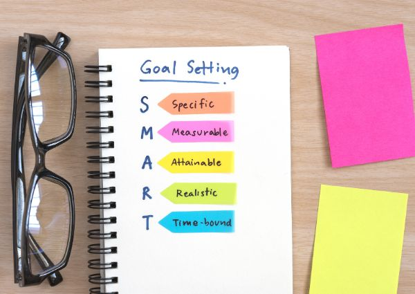
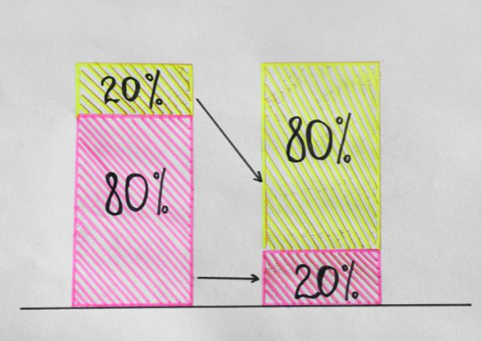

# How to improve productivity: 7 Simple steps for your workplace

If you are reading this article, it means you are trying to figure out how to be more productive. That’s why we decided to build a short guide with 7 simple steps you can follow to enhance your results at your workplace.
<!-- more -->
If you are reading this article, it means you are trying to figure out how to be more productive. That’s why we decided to build a short guide with 7 simple steps you can follow to enhance your results at your workplace.

<figure markdown="span">
  
</figure>

## 1. Meditation and breathing exercises

Incorporating mindfulness practices like meditation and breathing exercises can help reduce stress, increase focus, and enhance overall well-being. 

This is a great way to start the day before you feel overwhelmed with a lot of tasks, phone calls, and emails.

Take short breaks throughout the day to engage in mindfulness exercises, such as deep breathing or guided meditation. These practices can help calm the mind, improve mental clarity, and boost productivity by promoting relaxation and reducing overwhelming feelings.

## 2. Set clear goals and prioritize tasks

<figure markdown="span">
  
</figure>

Once you have worked through meditation, it is necessary to set clear, achievable goals for each day or week. For instance, break down larger projects into smaller, manageable tasks, and prioritize them based on urgency and importance.

Use tools like to-do lists, calendars, or project management software to organize tasks and track progress. By having a clear roadmap of what needs to be accomplished, you can stay focused and motivated to tackle your workload efficiently.
We know it can be hard to look at 10 or 20 tasks and feel stressed about where to start. So, the recommendation here is to prioritize the more urgent ones and try to finish them as soon as possible.

Let’s say you arrive at the office at 7:50 am, that gives you 10 minutes to set your goals for the day or even the morning. Write down the one you need to finish soon and focus only on that. Once you are done, move on to the next goal, and so on.

## 3. Create a distraction-free environment

Distractions can significantly impact your productivity and hinder your ability to concentrate on tasks. Take proactive steps to create a distraction-free work environment by minimizing interruptions and eliminating unnecessary distractions.

This may involve turning off notifications on your phone, setting specific work hours, or using noise-canceling headphones to block out background noise. Designate a dedicated workspace that is free from clutter and conducive to focus and concentration.

As a recommendation, try to schedule meetings only on specific times and days, this way, you won’t be worried about having meetings at any moment that will constantly interrupt your [workflow](https://deepdeck.co/blog/workflow-optimization-and-automation/){:target="_blank"}.

!!! Tip 
    Turning off notifications on your phone during specific work hours will improve your productivity at work.

## 4. Implement time management techniques

Effective time management is key to improving productivity and making the most of your workday. Consider using time-blocking techniques to allocate specific time slots for different tasks or activities.

Break your workday into manageable chunks of time, and alternate between focused work sessions and short breaks to maintain momentum and prevent burnout. Experiment with productivity methods such as the Pomodoro Technique or the 80/20 principle to optimize your workflow and productivity levels. 

The 80/20 principle, also known as the Pareto principle, suggests that roughly 80% of outcomes result from 20% of activities (or effort) you perform. While 80% of “secondary tasks” will only get you 20% of your desired results.

<figure markdown="span">
  
</figure>

On the other hand, the Pomodoro technique is a time management method that involves breaking work into intervals, typically 25 minutes long, separated by short breaks. For instance, if you take short breaks to stretch and relax your mind, you will keep good energy throughout the day and you will benefit your body as well.

## 5. Practice effective communication and collaboration

Effective communication is essential for maximizing productivity in the workplace. Foster open communication channels with colleagues, managers, and clients to clarify expectations, share updates, and resolve issues efficiently. 

Use collaboration tools and platforms to streamline communication, document sharing, and project management, enabling seamless collaboration regardless of location or time zone.

Use platforms such as Discord, Slack, Trello, Miro, Google Docs, or Google Sheets. Any tool that allows you to keep track of your progress, and that allows other team members to collaborate remotely without the need of scheduling constant meetings.

## 6. Optimize your workspace with ergonomic solutions

Your physical workspace plays a significant role in your productivity and comfort level throughout the workday. People don’t pay enough attention to this aspect, and in some places like the UK, and the US, people who work from home have experienced back and neck pains since the COVID-19 pandemic because of bad postures during work hours.

This is why is necessary to invest in ergonomic furniture and accessories, such as an adjustable desk, ergonomic chair, and proper lighting, to create a comfortable and efficient workspace.

**If you work with repetitive tasks** and you don’t want to lose time remembering a combination of keys or scrolling with your mouse to perform a specific action, it’s recommended to **get a macropad** and create custom shortcuts; see [what is a macropad](https://deepdeck.co/blog/macropad-definition/){:target="_blank"}. With a macropad, you will save time and effort when using your computer.

!!! Tip 
    With an [open source macropad](https://deepdeck.co/){:target="_blank"} you can reduce the time you need to perform repetitive tasks.

## 7. Prioritize self-care and work-life balance

Finally, prioritize self-care and work-life balance to maintain long-term productivity and prevent burnout. According to a study made by the American Psychological Association ([2023 Work in America Survey](https://www.apa.org/pubs/reports/work-in-america/2023-workplace-health-well-being){:target="_blank"}), *“92% of workers said it is very (57%) or somewhat (35%) important to them to work for an organization that values their emotional and psychological well-being.”*

This means you should pay attention to your well-being, **how can you do it?** Make time for regular exercise, healthy meals, and adequate sleep to recharge your energy levels and enhance cognitive function.

<figure markdown="span">
  
</figure>

Set boundaries between work and personal life to prevent overwork and ensure time for relaxation, hobbies, and social connections. Remember that taking care of your physical and mental well-being is essential for sustained productivity and overall success in the workplace.

**By implementing these seven steps to be more productive, you can boost your efficiency, reduce stress, and achieve greater success in your professional activities.** 

Remember to experiment with different strategies and tailor them to your unique needs and preferences to find what works best for you. *With dedication and perseverance, you can unlock your full potential and thrive in today's competitive work environment.*