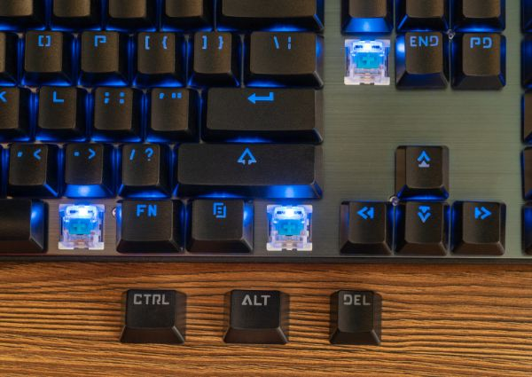

# Useful keyboard macros for time-saving tasks

In today’s world, every second counts, especially when there are several activities to be done at the same time. If you have found yourself trying to accomplish several tasks on your computer, you would appreciate having some useful keyboard macros to work faster.

<!-- more -->

<figure markdown="span">
  
</figure>

Keyboard macros, also known as keystroke macros, are a series of automated commands that can be executed with a single keystroke or command. Think of macros as your digital assistant, capable of performing repetitive tasks at the push of a button. 

## **How to set up useful macros for your keyboard**

Setting up macros may sound daunting, but it's surprisingly simple. Most modern keyboards come with software that allows you to record and assign macros effortlessly. Alternatively, operating systems like Windows and macOS offer built-in tools for creating and managing macros. With just a few clicks, you can record your desired actions, assign them to a key or combination, and watch as your productivity soars.

## **Examples of good keyboard macros:**

The possibilities with macros are virtually endless. Need to type out your email signature with a single keystroke? There's a macro for that. Want to open multiple programs simultaneously with a single command? You guessed it – macros have you covered. From automating mundane tasks to supercharging your gaming experience, macros are the ultimate multitasking tool.

## **Benefits of using macros:**

The benefits of incorporating macros into your [workflow optimization](https://deepdeck.co/blog/workflow-optimization-and-automation/){:target="_blank"} needs are manifold. By automating repetitive tasks, **macros not only save you time** but also reduce the risk of errors and inconsistencies. Plus, with the ability to customize and tailor macros to your specific needs, you're in complete control of your computing experience. Say goodbye to tedious manual input and hello to newfound efficiency.

Now, these macros can be configured on your keyboard, or with the help of a macropad ([what is a macropad](https://deepdeck.co/blog/macropad-definition/){:target="_blank"}). Let’s see some of the best keyboard macros you can use on your computer.

!!! quote 
    A good keyboard macro allows you to take advantage of customization and efficiency.

### **Useful keyboard macros for multiple tasks:**

<figure markdown="span">
  
</figure>

For instance, if you are working on Windows, and you need to change between different applications, you can use the following keystroke macros to be more productive ([How to improve productivity](https://deepdeck.co/blog/how-to-improve-productivity/){:target="_blank"}):

++alt+tab++

Switches between open windows. Once you press the Alt and Tab keys at the same time, you can keep the Alt key pressed and press Tab as many times as you need to arrive at the window you need to open.

++windows+tab++

This combination opens Task View, allowing you to switch between windows using the arrow keys. It also displays a second desktop that you can create with ease.

++windows+d++

Minimize all windows and show the desktop.

++windows+l++

Lock the computer.

++alt+f4++

Close the active window **(heads up, don’t do it while reading this article).**

++windows+e++

Open File Explorer.

#### **Text Editing:**

Below are useful keyboard macros for writing on your computer or working with text and images.

!!! example "Useful keyboard macros for text editing"
    Ctrl + C: Copy selected text or items.

    Ctrl + X: Cut selected text or items.
    
    Ctrl + V: Paste copied or cut text or items.
    
    Ctrl + Z: Undo the last action.
    
    Ctrl + Y: Redo the last undone action.

#### **System functions:**

Let’s see some good keyboard macros for opening system functions.

++windows+r++

Open the Run dialog box.

++ctrl+shift+esc++

Open Task Manager directly.

++windows+media-pause++

Open System Properties.

#### **Google Chrome:**

We also want to provide you with some useful keyboard macros for Google Chrome.

++ctrl+w++

Closes the current tab in Chrome **(heads up, don’t do it while reading this article).**

++ctrl+t++ 

Opens a new tab in Chrome.

++ctrl+shift+t++

If you closed a tab by mistake, you can simply press these keys to reopen the last closed tab.

*You can use the following macros to manage your tabs on Google Chrome:*

++ctrl+tab++ 

Switch to the next tab.

++ctrl+shift+tab++ 

Switch to the previous tab.

++ctrl++ + 1 to 9 

Switch to a specific tab by its position.

#### **Page manipulation:**

++ctrl+f++ 

Open the find bar to search for text on the current page.

++ctrl+r++ 

Refresh the current page.

++ctrl+shift+r++ 

Refresh the page without using cached content (hard refresh).

These keyboard shortcuts can significantly enhance your efficiency and speed up your workflow while using Windows and Chrome. Experiment with them to find the combinations that work best for your needs.

Remember, **if you want to use the best keyboard macro, you can count on DeepDeck**, which is highly recommended for customizing any macro or shortcut you want to use. Click on the button below to get your macropad.

<figure markdown="span">
  [I want a DeepDeck](https://bit.ly/3TbV0cd){ .md-button .md-button--primary }
</figure>