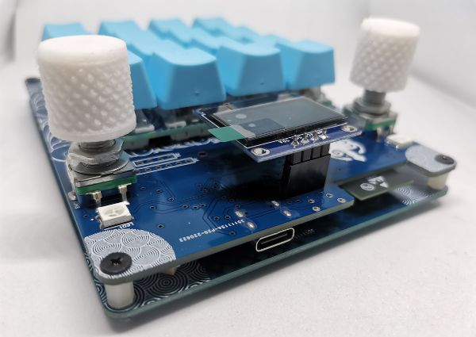
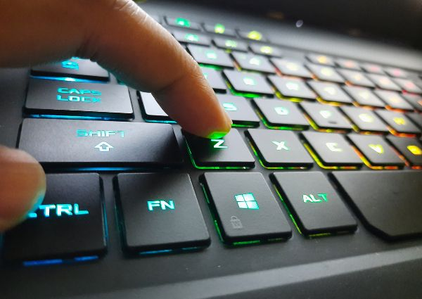

# What is a Macropad and different uses

Are you looking for tools to boost your productivity when you are on the computer? You probably have heard about macropads. But, what is a macropad? we will explore this interesting product in the present article, and we will mention different ways to use it.

<!-- more -->

<figure markdown="span">
  
</figure>

## **What is a Macropad?**

At its core, a macropad is a compact peripheral device equipped with programmable keys, often called macro keys. These keys can be customized to perform specific functions or execute sequences of commands with a single press, offering a shortcut to repetitive tasks and boosting efficiency. You can connect the macropad to your computer via a USB cable, Bluetooth, or wifi.

For instance, you can take **macro keys or special combinations and assign them to a single key of the macropad**. This way, you’ll be able to automate several repetitive tasks.

Macropads come in different shapes and sizes, you can find devices with just one or two keys, and others with over 12 keys. Every macropad has its own programming and customization capabilities, and depending on your taste, you can use it for different tasks.

## **What are Keyboard Macros?**

Keyboard macros are sequences of commands or actions that are recorded and assigned to a single key or combination of keys. By recording a series of keystrokes, mouse clicks, or other input actions, users can create custom macros tailored to their specific needs.

For instance, you can take advantage of these combinations and assign them to a single key on a macropad:

!!! example "Popular keyboard shortcuts"
    CTRL + C = COPY
    
    CTRL + V = PASTE

And you may wonder, **why would I need to automate these actions?** Well, when it comes to being more productive, you can save time by programming these keyboard shortcuts when you are focused on writing, or moving data from one side to another.

Of course, this is just a basic example, but you can check several keyboard macros on each software that you use, even your browser allows you to use it by hitting on several keys at the same time to perform different tasks.

### **Different Macropad uses**

<figure markdown="span">
  
  <figcaption>Keyboard macros</figcaption>
</figure>

Now that we've covered the basics, let's explore some of the practical uses of macropads:

#### **Copy and Paste:** 

As we mentioned above, assigning a macro key to the copy-and-paste function can save valuable time when working with text or files. With a single press of a button, you can copy selected content and paste it wherever needed, eliminating the need for manual copying and pasting.

#### **File management:**

Macropads can streamline file management tasks by assigning macros to common actions such as creating new folders, renaming files, or moving files to specific directories. This can greatly simplify the process of organizing and managing your digital files.

#### **Productivity:**

**Customize macros to automate repetitive tasks in your daily workflow**, such as opening new tabs on Google Chrome, reopening previously closed tabs, incognito mode, print screen, changing between applications, and formatting text with bold and italic features, among others.

But well, don’t think it can only be used for web browsers. *Macropads can be used with your favorite design software, like Photoshop, Illustrator, Adobe Premiere, VS Code, etc*.

You just need to know which keyboard shortcuts each software has and assign them to specific keys of the macropad, and that’s it, each time you use any of those programs, you will be ready to enhance your productivity.

#### **Multimedia control:**

A macropad can be used to control your media playback with ease by assigning macro keys to play, pause, skip tracks, or adjust volume. Whether listening to music, watching videos, or giving presentations, having quick access to multimedia controls can enhance your multimedia experience.

#### **Gaming macros:**

Gamers can benefit from macropads by assigning macros to in-game commands, macros for specific character abilities, or quick item usage. This can give you a competitive edge in fast-paced games and make complex actions more accessible.

### **Save time with a macropad**

**We are in an era where time runs faster**, or maybe we have more to do in a short amount of time. It doesn’t matter how you want to see it, but one thing is for sure, when you know the shortcuts on your keyboard, you will have an advantage over other people who don’t use them for different tasks.

Whether you're a professional looking to streamline your workflow or a gamer seeking a competitive edge, macropads provide endless possibilities for customization and efficiency. With customizable macro keys and the ability to automate repetitive tasks, macropads empower users to take control of their digital workflow and achieve more in less time.

!!! quote 
    Macropads provide endless possibilities for customization and efficiency.

<figure markdown="span">
  [I want a macropad](https://bit.ly/3TbV0cd){ .md-button .md-button--primary }
</figure>

