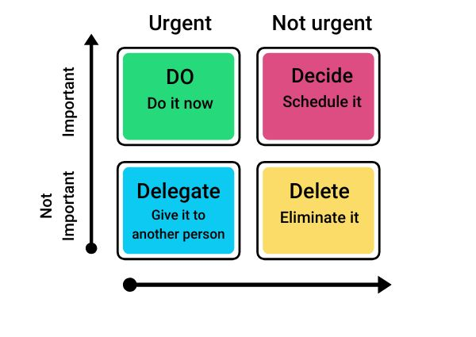
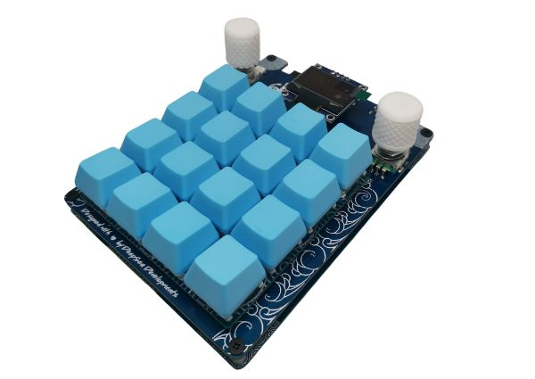

# Workflow optimization and automation: Strategies for efficiency

Effective workflow optimization is essential for maximizing productivity and achieving success in both personal and professional endeavors. But what exactly is a workflow, and how can you optimize it to streamline your tasks and boost efficiency?
<!-- more -->
In this article, we'll explore the concept of workflow optimization, discuss strategies for maximizing efficiency, and introduce powerful automation tools like DeepDeck to supercharge your productivity.

<figure markdown="span">
  
</figure>

## **Workflow optimization meaning**

A workflow is a **sequence of interconnected tasks or processes** that are completed to achieve a specific goal or objective. Whether you are managing projects, handling client requests, or completing daily tasks, having a well-defined workflow is crucial for maintaining organization and staying on track.

Workflow optimization involves analyzing and refining your existing processes to eliminate inefficiencies, reduce unnecessary steps, and improve overall productivity. By optimizing your workflow, you can improve your tasks, minimize errors, and maximize output, ultimately saving time and resources.

### **Strategies for workflow optimization**

#### 1. Identify bottlenecks:

Start by identifying areas in your workflow where tasks are frequently delayed or stalled. **These bottlenecks could be caused by inefficient processes**, lack of resources, or communication breakdowns. Once identified, take steps to address and eliminate these bottlenecks to keep your workflow running smoothly.

#### 2. Streamline processes:

Look for opportunities to streamline your processes by eliminating unnecessary steps, **automating repetitive tasks**, and standardizing procedures. By simplifying your workflow, you can save time and reduce the risk of errors, allowing you to focus on more important tasks.

#### 3. Prioritize tasks:

Prioritize your tasks based on urgency and importance to ensure that you're focusing your time and energy on the most critical activities. 

Use techniques like *the Eisenhower Matrix* or task prioritization tools to categorize tasks and allocate your resources effectively.

<figure markdown="span">
  
</figure>

Another way is to use **the Pareto principle**, also known as **the 80/20 rule**. This principle suggests that roughly 80% of results come from 20% of efforts, highlighting the unequal distribution of inputs and outputs in various aspects of life, including productivity.

When it comes to workflow optimization, the Pareto Principle can be applied in several ways to streamline tasks and prioritize activities effectively:

**Identifying the vital few:** Analyze your task list and identify the 20% of tasks that contribute to 80% of your desired outcomes or results. These tasks are often high-impact activities that directly align with your goals or objectives.

!!! Tip 
    Identify the 20% of tasks that contribute to 80% of your desired outcomes or results.

**Prioritizing high-impact tasks:** Once you've identified the vital few tasks, prioritize them based on their importance and urgency. Focus your time and energy on completing these tasks first, as they are likely to have the most significant impact on your productivity and success.

**Eliminating or delegating low-value tasks:** Identify the remaining 80% of tasks that contribute minimally to your desired outcomes and consider eliminating or delegating them to free up time and resources for more critical activities. By reducing the time spent on low-value tasks, you can focus on high-impact activities that drive results.

**Optimizing time and resources:** Allocate your time and resources strategically to maximize efficiency and effectiveness. Invest more time in high-impact tasks that align with your goals, and minimize time spent on low-value activities that yield minimal returns.

**Continuous evaluation and adjustment:** Regularly review and evaluate your task list to ensure that you're focusing on the right priorities. Adjust your priorities as needed based on changes in goals, deadlines, or circumstances, and remain flexible in your approach to workflow optimization.

#### 4. Implement automation:

Leverage software and automation tools to automate repetitive tasks and streamline your workflow. By doing this, you can save valuable time and reduce manual effort, allowing you to focus on more strategic activities that lead to greater efficiency.

#### 5. Optimize collaboration:

Improve collaboration and communication within your team by using collaborative tools like Google Workspace, Notion, Trello, or Discord. With such tools, team members can work together in real-time, share documents, and collaborate on projects seamlessly. 

By optimizing collaboration, you can ensure that everyone is on the same page and working towards common goals.

## **Workflow automation tools - DeepDeck**

<figure markdown="span">
  
  <figcaption>DeepDeck is perfect as a workflow automation tool</figcaption>
</figure>

Once you have understood the importance of workflow optimization and the need for automation implementation, we want to talk to you about **DeepDeck**. Which is a versatile [programmable macropad](https://deepdeck.co/){:target="_blank"} designed to streamline your workflow and boost productivity. With customizable macro keys and open-source software, DeepDeck empowers users to automate repetitive tasks and optimize their workflow with ease; see [what is a macropad](https://deepdeck.co/blog/macropad-definition/){:target="_blank"}.

!!! quote 
    DeepDeck is designed to streamline your workflow and boost productivity.

Let’s see some workflow automation examples so you can understand how to take advantage of this automation tool for your workflows:

### **Automated text formatting:**

With DeepDeck, you can assign custom shortcuts to common text formatting commands, such as bold, italic, or underline in Google Docs. Instead of manually formatting text, or copying and pasting text, simply press a macro key to apply formatting instantly, saving time and reducing manual effort.

When you are on Google Docs, just hit the following keys to open the shortcuts list and program your macropad the way you want:

**Windows, Chrome OS**

++ctrl+slash++

**Mac**

++command+slash++

This will open all shortcuts that can be used in Google Docs, then, you choose the ones that best fit your needs, and assign them to the different keys of the macropad.

### **Efficient data entry:**

Streamline data entry tasks in Google Sheets by assigning macros to insert formulas, copy and paste values, or navigate between cells. With DeepDeck, you can automate these repetitive tasks and complete them with a single keystroke, improving efficiency and accuracy.

You can also check the different keyboard shortcuts this platform has by hitting on the following keys:

**Windows, Chrome OS**

++ctrl+slash++

**Mac**

++command+slash++

### **Quick navigation:**

Have you found yourself losing time trying to find the tab you were working on or where you had important information?

Well, if you need optimized workflow, it is necessary *to count on a good macropad like DeepDeck* that allows you to **customize your macro keys** with ease to switch between browser tabs or navigate to different windows, allowing you to work more efficiently and stay organized.

**Mastering workflow optimization is essential for maximizing productivity** and achieving success in today's fast-paced world. By implementing strategies like identifying bottlenecks, streamlining processes, and using automation tools like DeepDeck, you can streamline your tasks, minimize errors, and maximize efficiency, ultimately leading to greater productivity and success in your projects or tasks.