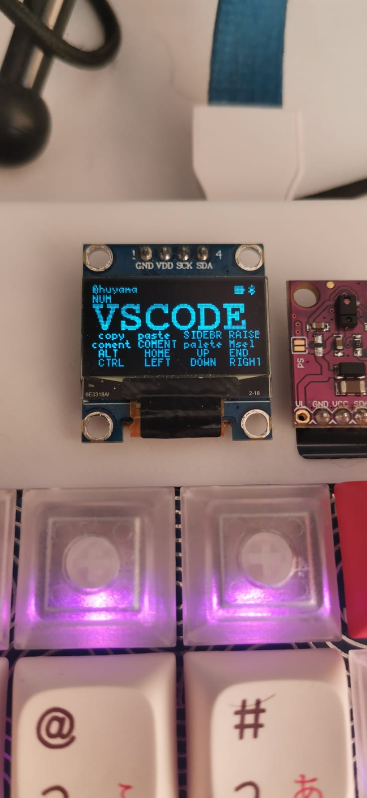
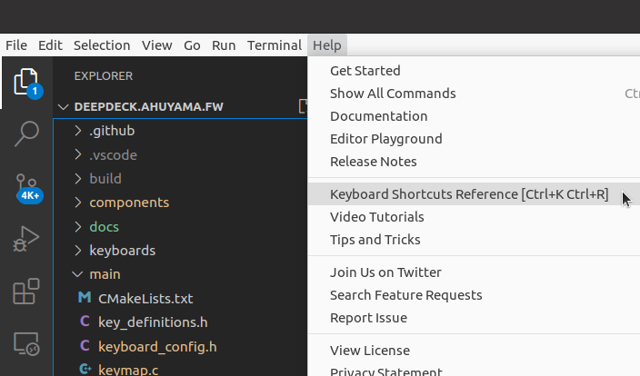
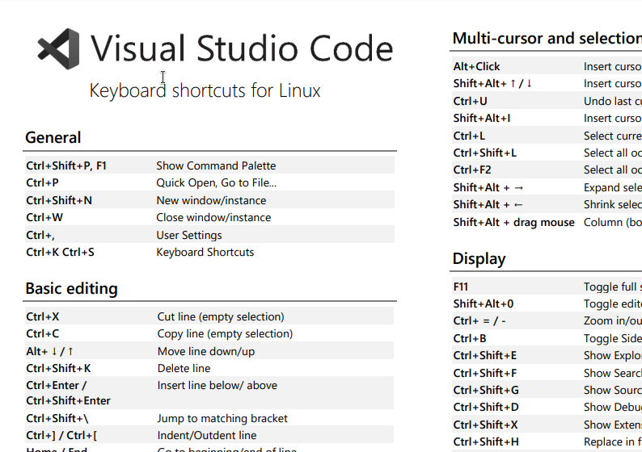
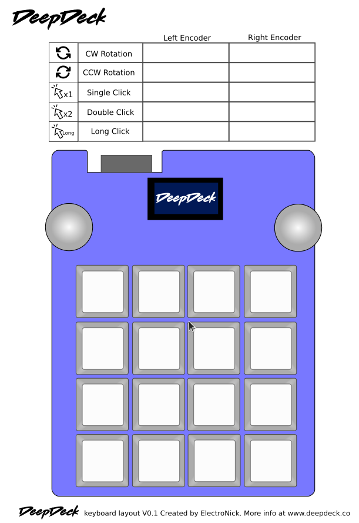

# Use it with visual studio code!

Hi everyone!

In this first week, we want to thank our backers, your support means a lot for us! If you haven't backed us yet, feel free to ask any questions you might have to convince you having a DeepDeck is a must.

<!-- more -->

<figure markdown>
  <iframe width="560" height="315" src="https://www.youtube.com/embed/PQ5tDf7mJB0?si=TsHzYZc8kVbK4iUu" title="YouTube video player" frameborder="0" allow="accelerometer; autoplay; clipboard-write; encrypted-media; gyroscope; picture-in-picture; web-share" allowfullscreen></iframe>
</figure>

One of our backers send us a question that made us integrate a *new feature* into the project. She asked us if we could integrate the name of the keys on the OLED, so we did!

<figure markdown="span">
  { width="300" }
</figure>

<figure markdown="span">
  { width="300" }
</figure>

We also wanted to show the process of integrating a new layer into DeepDeck. We are going to make it with Visual Studio Code.

### 1. Explore

First of all, it's good to explore which shortcuts are available first. 

<figure markdown="span">
  { width="450" }
</figure>

{deepdeck-shortcut-screen | link}

After inspecting the list of shortcuts, I found some very interesting and useful commands.

<figure markdown="span">
  { width="450" }
</figure>

### 2. Filter

Ok, so you can't have all the shortcuts in one layer (you could have several layers, but that might not be convenient). You have to decide what is best, where (a key, a knob, what key?). You can do it directly with  DeepDeck's web app, but some people like to write on paper first. That's why we made a simple layout (pdf) so you can try and write things down if you desire.

<figure markdown="span">
  { width="450" }
</figure>

### 3. Test & Iterate

Once you have programmed your keys and shortcuts, try them out to see if you feel comfortable or if you are missing something. If needed, you can go back and program them again in the web app. 

### 4. Results

Well, now you can play with, work with, and see if the layout is good for you, or adapt it as you please. I would have to say that the code surfing is my favorite shortcut, and the one that will save me the most time!
