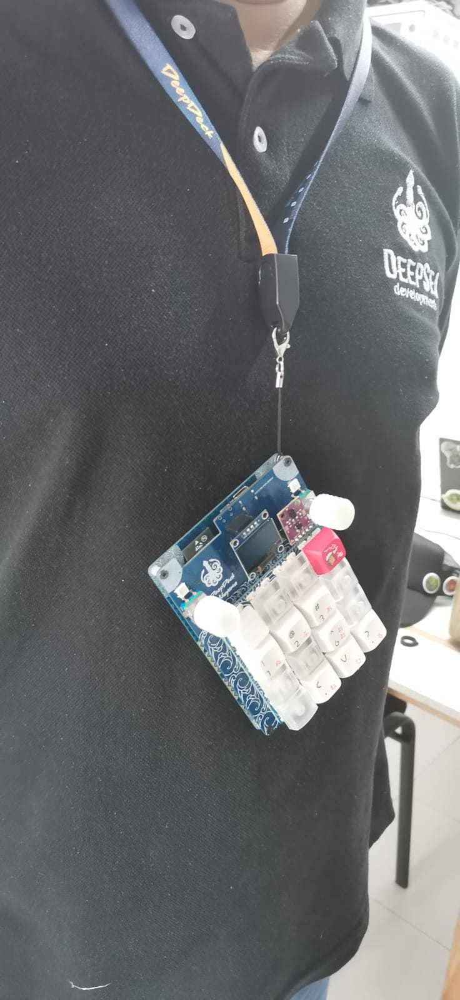
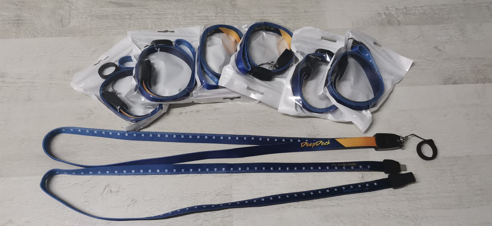

# Landyard, Pong, and fun!

As an additional perk to thank you all for helping us reach 250% of our campaign goal, we designed a USB Type-C lanyard so you can take your DeepDeck anywhere you want, and even use it as a badge for future events!

<!-- more -->

<figure markdown="span">
  { width="200" }
</figure>

<figure markdown="span">
  { width="600" }
</figure>

## Play Pong on DeepDeck!

See the video [here](https://www.youtube.com/shorts/52st622aWBg)

You can create pretty much anything you want with DeepDeck. The video above shows a game of pong, complete with scores. It's still proof of concept, so there's plenty of room for improvement, but it's enough —that you can  so you can have fun with friends! but your imagination is the limit!
