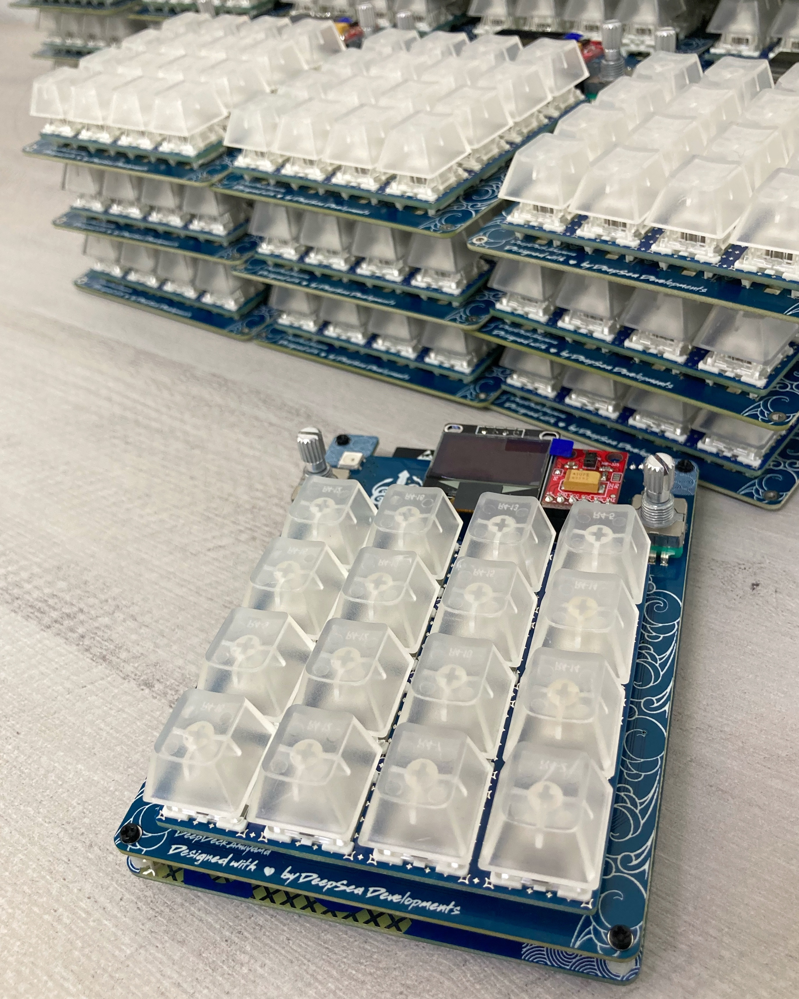

# Tell us about your experience with DeepDeck

Hi there, we are looking forward to improve our product, that's why we created a [short survey](https://bit.ly/49uD6Z9) for the DeepDeck community!

We would love your feedback on how have you been using the macropad, as well as performance, and potential improvements you might like to see in this great open source macropad. 

<!-- more -->

<figure markdown="span">
  { width="400" }
</figure>

1. Are you using it for gaming?
2. Have you improved your design skills?
3. Are you feeling more productive?

You'll have the chance to tell us that and more by answering the survey. PS, *If you already answered the survey in the Discord community, there's no need to answer again.*

You can find the link for the survey by clicking [here](https://bit.ly/49uD6Z9)

Thanks again for your help!