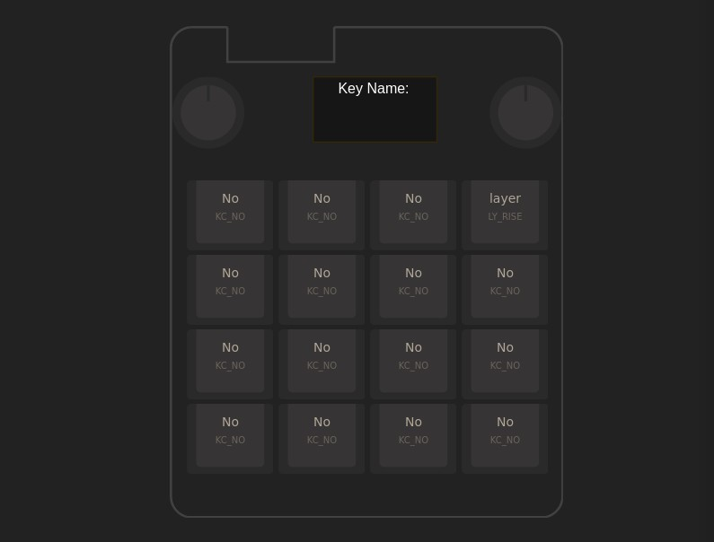
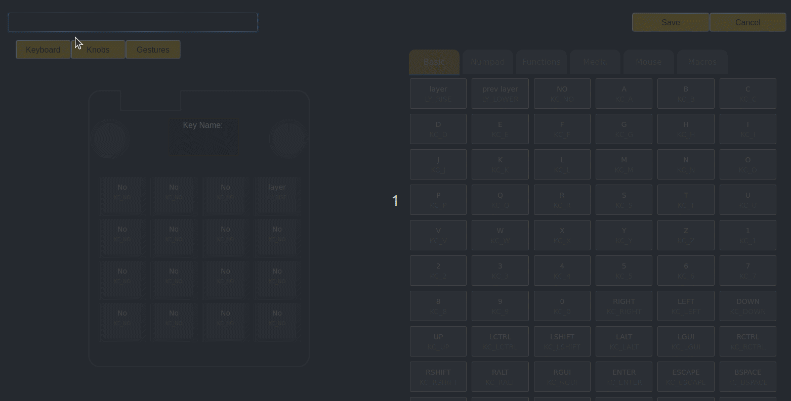
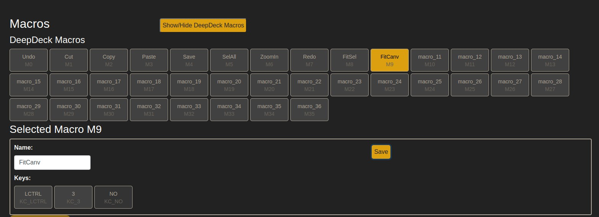
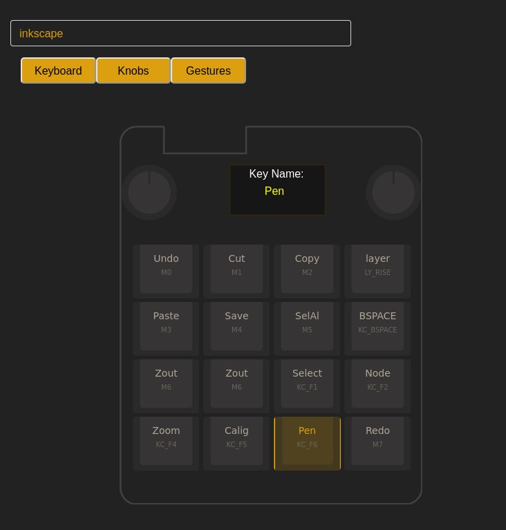

# Layer creation

In this tutorial we will see:

1. [Basic steps to create a layer](#create-a-layer)
2. [Create a new layer using DeepDeck and AI (ChatGPT).](#layer-creation-using-chatgpt)

## Create a layer

1. Go to the DeepDeck webserver
1. Go to Keymap>New layer
1. Change the name of the layer on the top.
1. You should see the empty layer. The NO (KC_NO) key is an empty key, it is used to notify the system to ignore it, and in case of the macros it tells the system the macro is over.

    

1. Select the key you want to modify in the macro and browse in the keys section on the right to select the one you want to use.



## Layer creation using chatGPT

ChatGPT and AI is here to make our life eassier, so let's use it.

You have to remember 2 rules:

- AI is not perfect, yo have to doble check to make sure the answer is OK.
- AI thinks she is perfect, so will be 100% confident she is OK.

Also remember that this is a conversation. If you think that is not correct, or you have a special request, feel free to moodify the promt or add more things to imporve your results.

We are going to go step by step, seeing the possible mistakes ChatGPT could make.

### Log into chatGPT
First log into [chatGPT](https://chat.openai.com/). At the time of writing this, the version 3.5 is free and is good enough for our goal.
If you don't have an account, follow the steps to create one.

### Start adding prompts
You can start with this promt. Remember to change the last line to reflect what layer you want to create.

``` hl_lines="53" title="Copy this into chatGPT promt, change higlithed line and put the name of the program you want to use"
You are part of the project DeepDeck (www.deepdeck.co). DeepDeck is an open source mechanical macropad with 16 mechanichal keys, 2 rotary encoders (knobs) with push buttons and a gesture sensor.  You will help me to create different layers for using it with different softwares. You have to follow the following rules:
1. When I ask you about a program, like photoshop, return a list of most used shortcuts of the program
2. Give me the list of possible options, so i can have a base
3. I will do changes and help.

This is an example of a layer, but before remember this rules:
1. There are 16 keys organized in 4 rows and 4 columns. For each key you should put a name (related to the function) and the corresponding key (i.e. "a") or the macro (i.e ctrl+alt+c).
2. There are 2 knobs. Each knob has 5 possible gestures, each gesture with a key or macro  related. The gestures are: turn clockwise, turn counterclockwise, single press, double press, and long press.
3. To name the layers begin from the top left and go from left to right and from up to down. For example k11 is the first key in the top left of the DeepDeck (first row, first column).  K32 would be the key in row 3, column 2.
3. All the layers should have a key name [layer] which is used to change the layers. It is normally located in k14.

This is the example:

Layer: Photoshop Shortcuts

Key Layout:

1. k11 (Ctrl+Z) - Undo
2. k12 (Ctrl+X) - Cut
3. k13 (Ctrl+C) - Copy
4. k14 ([Layer])
5. k21 (Ctrl+V) - Paste
6. k22 (Ctrl+S) - Save
7. k23 (Ctrl+A) - Select All
8. k24 (Delete)
9. k31 (Ctrl++) - Zoom In
10. k32 (Ctrl+-) - Zoom Out
11. k33 (B) - Brush Tool
12. k34 (E) - Eraser
13. k41 (C) - Crop
14. k42 (V) - Move Tool
15. k43 (Ctrl+Z) - Undo
16. k44 (Ctrl+Shift+Z) - Redo

Knob 1 Gestures:

1. Turn Clockwise - Increase Brush Size (])
2. Turn Counterclockwise - Decrease Brush Size ([
3. Single Press - Switch to Next Brush (, or .)
4. Double Press - Reset Brush to Default Size
5. Long Press - Toggle Brush Tool (B)

Knob 2 Gestures:

1. Turn Clockwise - Increase Zoom Level (Ctrl++)
2. Turn Counterclockwise - Decrease Zoom Level (Ctrl+-)
3. Single Press - Fit to Screen (Ctrl+0)
4. Double Press - Zoom to 100% (Ctrl+1)
5. Long Press - Toggle Hand Tool (Space)

------------

Help me create a layer for Inkscape. I use Ubuntu as my OS

```
### Answer from ChatGPT
The answer from ChatGPT is the following:

```
Of course, I'd be happy to help you create a layer for Inkscape on your DeepDeck! Here's a layout based on your guidelines:

**Layer: Inkscape Shortcuts**

Key Layout:

1. k11 (Ctrl+Z) - Undo
2. k12 (Ctrl+X) - Cut
3. k13 (Ctrl+C) - Copy
4. k14 ([Layer])
5. k21 (Ctrl+V) - Paste
6. k22 (Ctrl+S) - Save
7. k23 (Ctrl+A) - Select All
8. k24 (Delete)
9. k31 (Ctrl++) - Zoom In
10. k32 (Ctrl+-) - Zoom Out
11. k33 (F1) - Select Tool
12. k34 (F2) - Node Tool
13. k41 (F4) - Zoom Tool
14. k42 (F5) - Calligraphy Tool
15. k43 (F6) - Tweak Tool
16. k44 (Ctrl+Shift+Z) - Redo

Knob 1 Gestures:

1. Turn Clockwise - Increase Brush Size (])
2. Turn Counterclockwise - Decrease Brush Size ([
3. Single Press - Switch to Next Brush (, or .)
4. Double Press - Reset Brush to Default Size
5. Long Press - Toggle Select Tool (F1)

Knob 2 Gestures:

1. Turn Clockwise - Increase Zoom Level (Ctrl++)
2. Turn Counterclockwise - Decrease Zoom Level (Ctrl+-)
3. Single Press - Fit to Selection (Ctrl+1)
4. Double Press - Fit to Canvas (Ctrl+3)
5. Long Press - Toggle Node Tool (F2)

Feel free to review and modify this layout to match your preferences. The Inkscape shortcuts provided here are based on the default keyboard shortcuts for the software. Let me know if you'd like to make any changes or adjustments!
```

In general terms it looks OK. But as we have to add the macro first, lets ask it to do a list of the used macros.

### Ask for a list of used macros

```
Can you give me a list of the elements that use 2 or more keys (like ctrl+s), 
including the 16 keys and the gesture from both knobs please.
```

Chat GPT answers:

```
Certainly! Here's a list of the elements that use 2 or more keys, 
including the 16 keys and the gestures from both knobs for the Inkscape Shortcuts layer:

Keyboard Shortcuts:

Ctrl+Z - Undo
Ctrl+X - Cut
Ctrl+C - Copy
[Layer]
Ctrl+V - Paste
Ctrl+S - Save
Ctrl+A - Select All
Delete - Delete
Ctrl++ - Zoom In
Ctrl+- - Zoom Out
F1 - Select Tool
F2 - Node Tool
F4 - Zoom Tool
F5 - Calligraphy Tool
F6 - Tweak Tool
Ctrl+Shift+Z - Redo
Knob 1 Gestures:

Turn Clockwise - Increase Brush Size (])
Turn Counterclockwise - Decrease Brush Size ([
Single Press - Switch to Next Brush (, or .)
Double Press - Reset Brush to Default Size
Long Press - Toggle Select Tool (F1)
Knob 2 Gestures:

Turn Clockwise - Increase Zoom Level (Ctrl++)
Turn Counterclockwise - Decrease Zoom Level (Ctrl+-)
Single Press - Fit to Selection (Ctrl+1)
Double Press - Fit to Canvas (Ctrl+3)
Long Press - Toggle Node Tool (F2)
Remember that you can customize these based on your preferences and how you use Inkscape. Let me know if you need any further assistance or modifications!
```

That is pretty much the same as the first answer. **So, useless**. anyway, lets proceed creating macros on the DeepDeck Webserver.

### Add macros into the webserver

As we dont care about the other layers, we will overwrite the macros from the first one.



### Create new layer

Go to Keymap>Layer>New Layer

Proceed to select the keys on the DeepDeck layout and assign the desired keys on the list on the right.



You can also change the name of the keys by selectiong the *Key name* in the top of the DeepDeck Layout. Just click and change the name.

When you are finished, you can click on Save and you can start using the new layer.

## Testing the  new layer

Remember I told you not to trust in ChatGPT?
Well, after testing some of the shortcuts, they either dont work or do something different. Anyway, is a good help to save time. You can get back into layer page and modify the name.
