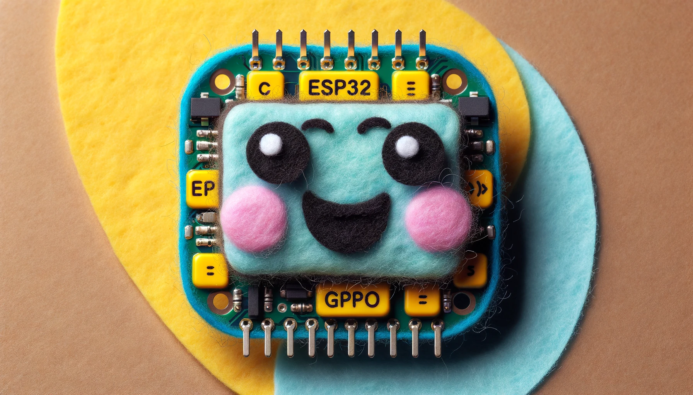

# DeepDeck Firmware

{ align=right width=350 }

DeepDeck is build on top of [ESP32](https://www.espressif.com/en/products/socs/esp32). This is a versatile, low cost, and popular microcontroller.

## Why we used the ESP32

It's really cheap for all the things it have. The brand its relatively new (espressif) but with all the advances through the years, it has proven to be reliable.
It has:

- **Wifi and bluetooth integrated** (something not so common before in microcontrollers)
- Dual core
- Versatile GPIOS (can be programmed for multiple options)
- Extensive libraries to have cool things like an embedded webserver

## Downside of using ESP32

The world of mechanical keyboards are rule by **QMK** and similar frameworks. There is not an official port (at the time we wrote this) for ESP32. This mean that if you are a knowledgeable user of QMK, there will be features working there that are not working here yet (but you can program them!).

But anyway we did not wanted this to be a copy of QMK (even though the base code we used when we started this project is an unofficial port), but we wanted to make DeepDeck **more than a PC peripheral**. We intent it to be a standalone device as well, that can act by itself, connecting to a server and doing things like doing** home automation actions**, **sending an automated email**, **running and logging Pomodoro timers**, etc.

## What is ESP-IDF?

[ESP-IDF](https://docs.espressif.com/projects/esp-idf/en/stable/esp32/get-started/index.html) (Espressif IoT Development Framework) is a framework that makes programming in ESP32 much more easier. Operating pins (inputs and outputs) without it is relatively simple, but mounting a webserver, or managing all the bluetooth stack "by hand" just doesn't make sense. The project started with IDF version 4 (every commit before the release 0.6.0 works with idf 4.4), and from **version 0.6.0 and ahead, everything use IDF version 5**.

!!! warning "IDF version matters!"

    IDF versions are not compatible!.
    If you try to compile the latest version of DeepDeck with version 4.4 it will simply throw a bunch of errors. Take this into account if you face weird problems, specialty if its the first time you compile the project.

### Esp32 has an OS: FreeRTOS

ESP-IDF works with an Operative System, called **[FreeRTOS](https://www.freertos.org/index.html)**. It is a **Real Time Operative System**, that means that works like your windows, mac or linux, in the sense that can** run different "programs" or tasks "at the same time"** (really it gives the illusion of doing it at the same time), but unlike your regular OS, **it is time constrained**. This mean that if you need a task to be run every x milliseconds, you can tell the program to do so, and **assure** it will make it. This is impossible for a regular OS.

This is why there are some sensors, that will not work properly in RaspberryPi, because the usage of non-standard protocols that are very strict with time. RaspberryPi is powerful but it's regular linux-based OS can't handle it.

## What about Arduino?

We will release an arduino version for you to tinker!, but not yet. We are looking ways of just porting our version without having to rewrite all, but we want to have more features on the main code, before jumping to arduino.
There is a basic version of arduino to control the keys, but does not have the features of the main code of DeepDeck. <!-- TODO link the arduino version -->

## What will you see in the Firmware Section

We will guide you through the process of:

- Installing VScode and all the tools to get things working
- Understanding the repository structure
- Understanding the code structure (work in progress)