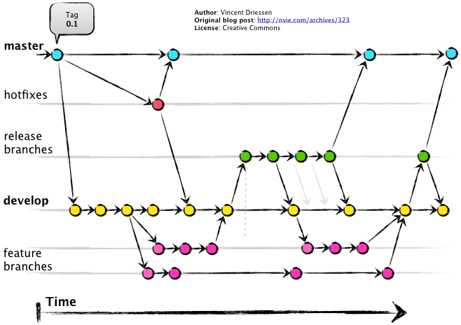

# Understanding the DeepDeck firmware repository

{ align=right width=350 }

The way we organize our repo is using the framework called GitFlow.

The idea is to give meaning to the different branches of the repo depending on the stage of the project.
The figure below shows the typical organization, where Master, or main have the latest stable code, and most of the time it is tagged. Develop is where the magic happens, but it also have the feature branches to be more organized.

For example, I'm implementing a new feature in DeepDeck called TapDance. I would make a branch from develop to feature/tapdance. When I finish everything there, i will merge back to develop.  

<figure markdown="span">
    
</figure>

## Usage of gitflow on DeepDeck

Gitflow offers more branches that we need, so it would be strange to found one for hotfix for example, so we differ a bit from the image above. Here is how we use it:

- **main:** Has the code of the latest release done. if we are in version 0.5.7, then that code is the one in main. 
- **develop:** It's the latest code being develop. Normally is a working code and stable, but you can check the git logs to see the comments.
- **feature/< name_of_feature >:** This branches will hold the feature being developed.
- **mkdocs:** This branch does not belong to the gitflow methodology. It is where all the documentation is (this webpage you are seeing right now)

In the next section we are going to explain how to contribute to the firmware repo.

Do you have any questions? you can put them in the **comment box below**.

