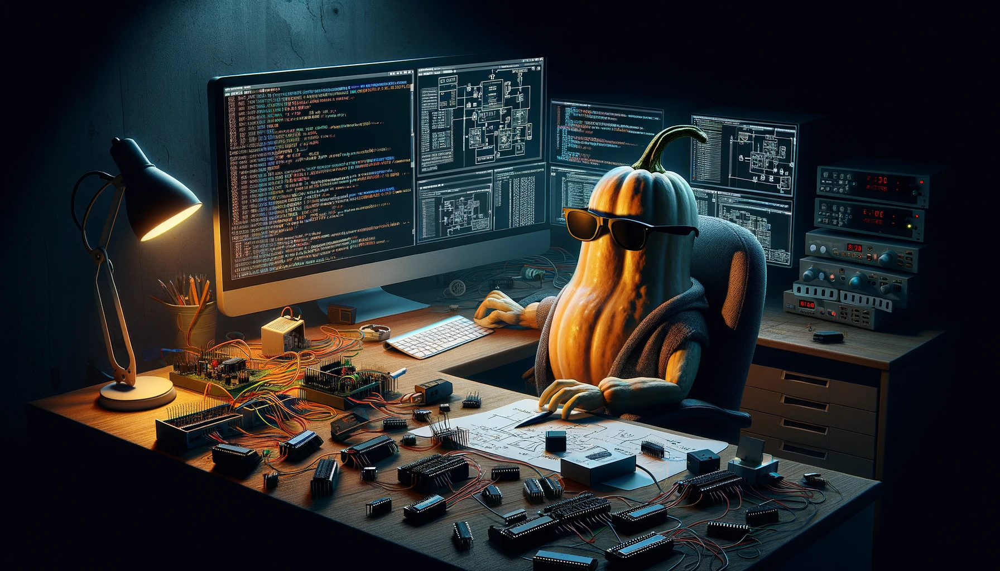
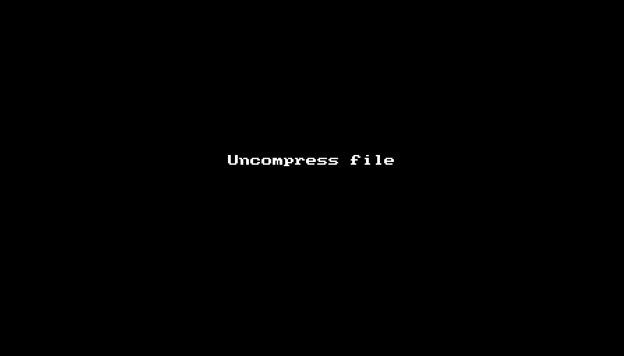
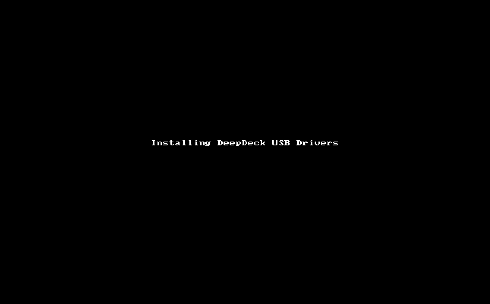

# Environment Setup

{ align=right width=350 }

This guide is for people that wants to play directly with the DeepDeck Code. If you want just to use it, you can go to the QuickStart Guide.

This guide will show you how to:

- [Environment Setup](#environment-setup)
  - [1. Install VScode](#1-install-vscode)
  - [2. Install USB drivers](#2-install-usb-drivers)
    - [Unzip file](#unzip-file)
  - [3. Install ESP-IDF plugin](#3-install-esp-idf-plugin)
  - [4. Clone Repository](#4-clone-repository)
  - [5. Program DeepDeck](#5-program-deepdeck)
  - [6. Ready to Go](#6-ready-to-go)

## 1. Install VScode    

The best way to program in ESP32 is with VScode. If you don't have it already, you can download it here for Windows, Linux, and Mac.

<figure markdown="span">
  [Download VScode :simple-visualstudiocode:](https://code.visualstudio.com/Download){:target="_blank" .md-button }
</figure>

## 2. Install USB drivers

<!-- TODO Check if in mac you have to install USB drivers -->

!!! note "Only for windows users"
    Linux and mac, you can [skip to the next section](#3-install-esp-idf-plugin)

The ESP32 we are using don't have a native USB controller. That's why it needs a chip from Slicion Labs to go from UART to USB. You need to install this driver in windows You can [check all the driver options here](https://www.silabs.com/developers/usb-to-uart-bridge-vcp-drivers?tab=downloads){:target="_blank"}, or just direct download the drivers in the following button: 

<figure markdown="span">
  [Download USB drivers :fontawesome-brands-usb:](https://www.silabs.com/documents/public/software/CP210x_Universal_Windows_Driver.zip
  ){:target="_blank" .md-button }
</figure>

### Unzip file

Go ahead and unzip the downloaded file.

<figure markdown="span">
  
</figure>

After this you have to:

1. **Connect the DeepDeck** with an USB cable to your PC
2. **Open the Device Manager** (Press the ++win++ key, type "device manager", and open the result program) 
3. Under *"Other devices"* **select the *CP2102N USB to UART Bridge controller***
4. Right click on top of it, and **select *Update Driver***
5. Select ***Browse my computer for drivers***.
6. Select the **folder where the drivers are located**. In my case *C:\Users\nick\Downloads\CP210x_Universal_Windows_Driver*, and make sure *include subfolders* is selected. Click *Next*.
7. It should start installing the driver, and then tell you in which port is connected. In my case is *COM3*, but yours can be other number.
8. The drivers are installed. All set. 

<figure markdown="span">
    
</figure>

## 3. Install ESP-IDF plugin

Follow this guide and maker sure to install lastes ESP32-IDF version 5. In our case, **version 5.2.1**

<figure markdown="span">
  [ESP-IDF vscode plugin guide :simple-espressif:](https://github.com/espressif/vscode-esp-idf-extension/blob/master/docs/tutorial/install.md
  ){:target="_blank" .md-button }
</figure>

## 4. Clone Repository

Copy or clone the **main** branch of the repository. This branch contains the latest versions. For different versions, check the different tags, or use the **develop** branch.

If unsure about this, go to the [repository section](repository.md) to understand how our repo is organized.

## 5. Program DeepDeck

## 6. Ready to Go

Ok now you can start exploring the code, doing changes and if you want to contribute, you can set a pull request into de develop branch!

<!-- TODO Guide the user on the page to contributing -->

